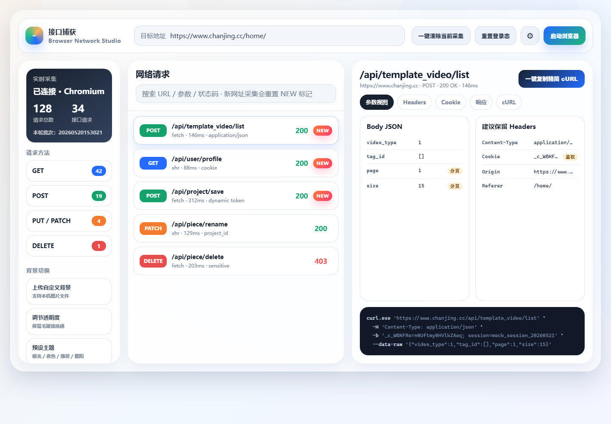

# 接口捕获软件

一款面向接口自动化测试准备阶段的桌面工具。它通过内置浏览器驱动启动受控 Chrome，自动采集用户真实操作过程中产生的网络请求，并把请求参数、Cookie、令牌、响应、cURL 和批量导出文件结构化展示，帮助测试人员更快把网页操作沉淀为接口测试资产。



## 项目定位

传统接口测试往往需要先打开浏览器开发者工具，手动复制请求、整理 Header、处理 Cookie、清理浏览器噪音参数，再导入 Postman、Apifox 或自动化测试脚本。这个过程重复、容易漏字段，也不适合批量处理。

接口捕获软件的目标是把这条链路变短：

- 从真实浏览器操作中自动采集请求。
- 自动按请求方法、接口类型和请求路径整理数据。
- 提供可视化参数视图，减少手工翻找成本。
- 一键生成精简 cURL，并支持批量导出到 Postman、OpenAPI、Apifox 和 cURL 文本。
- 保留独立浏览器用户目录，复用 Cookie、LocalStorage 和 SessionStorage，减少反复登录。

## 核心特点

- **真实浏览器采集**：通过受控 Chrome 访问目标网站，采集真实页面行为产生的请求，而不是手写接口地址。
- **多标签页覆盖**：用户在受控浏览器中手动打开新标签页、跳转页面或继续操作，后续请求仍可被采集。
- **重复请求自动收敛**：同一批次内相同 `method + domain + path` 的请求只保留最新一条，避免列表被轮询请求刷屏。
- **NEW 标记机制**：新采集请求会标记 `NEW`，点击查看详情后立即消失，方便快速识别新增接口。
- **参数可视化**：Query、Body、Headers、Cookie、令牌、响应和 cURL 分页展示，Body 可单独复制为标准 JSON。
- **精简 cURL**：自动剔除常见浏览器噪音 Header，如 `sec-fetch-*`、`sec-ch-ua-*`、`user-agent` 等，只保留接口测试更关注的信息。
- **批量导出**：选中多个请求后，可批量导出 Postman Collection、OpenAPI 3.0、Apifox 项目 JSON 或 cURL 文本。
- **桌面即用**：打包后以 exe 运行，普通用户不需要安装 Python、Node、npm 或 MySQL。
- **本地优先**：桌面版默认使用 SQLite，本地存储采集数据；团队部署时也可切换 MySQL。
- **可扩展架构**：后端按 API、Service、Repository、Model、Schema 分层，后续扩展导出格式、设置项、断言或 Mock 能力更容易。

## 运行原理

软件本质上由四层组成：

1. **桌面启动层**：用户启动 `NetworkCaptureTool.exe` 后，程序在本机启动一个 FastAPI 服务，并在终端输出访问地址。
2. **前端交互层**：用户通过 Vue 页面输入目标网址、查看请求列表、查看详情、切换背景、批量导出接口文件。
3. **浏览器采集层**：后端通过 Selenium + ChromeDriver 启动受控 Chrome，并开启 Chrome DevTools Protocol 网络监听。
4. **数据处理层**：后端解析 CDP 网络事件，提取请求参数、响应、Cookie、令牌、cURL，并写入 SQLite 或 MySQL。

简化流程如下：

```text
# 用户启动桌面程序
NetworkCaptureTool.exe

# 桌面程序启动本地服务
FastAPI Service -> http://127.0.0.1:8710/

# 用户在网页端输入目标网站
Vue UI -> POST /api/capture/start

# 后端启动受控 Chrome 并监听网络事件
Selenium + ChromeDriver + CDP Network

# 用户在受控浏览器中登录、点击、跳转、打开新标签页
Chrome Network Events -> Request Parser

# 后端结构化保存请求
SQLite / MySQL -> captured_requests

# 前端轮询同步并展示请求
Vue UI -> POST /api/capture/sync
```

## 和同类工具相比的优势

### 对比 Charles / Fiddler

Charles 和 Fiddler 更偏通用网络代理与抓包调试，能力强，但使用门槛也更高，尤其是 HTTPS 证书、代理配置、移动端抓包、复杂过滤规则等。

本软件的优势是：

- 不以代理为核心，不强依赖证书配置，更适合桌面网页接口采集。
- 直接从受控浏览器真实操作中采集请求，测试人员使用路径更接近日常网页操作。
- 自动面向接口自动化整理参数，而不是停留在原始网络包视角。
- 自带批量导出 Postman、OpenAPI、Apifox 和 cURL，更贴近接口测试落地。
- 对重复路径请求自动保留最新，减少广告、轮询、埋点请求带来的干扰。

### 对比浏览器 DevTools Network

浏览器开发者工具适合临时排查，但不适合长期整理接口资产。

本软件的优势是：

- 可持久化保存采集记录，支持历史批次查看。
- 可视化详情更聚焦接口参数，而不是浏览器内部网络面板。
- 支持批量选择和批量导出，减少逐条复制。
- 支持精简 cURL，自动过滤接口测试不需要的浏览器 Header。
- 支持点击后清除 `NEW` 标记，便于连续操作时追踪新增接口。

### 对比 Postman / Apifox

Postman 和 Apifox 是优秀的接口管理与调试工具，但它们更适合“已有接口”后的管理、调试、断言和团队协作。

本软件更适合做前置采集：

- 先从真实网页操作中批量捕获接口。
- 再把整理后的接口批量导入 Postman 或 Apifox。
- 适合从零梳理目标网站接口，或把手工测试流程转换为接口自动化素材。

换句话说，它不是替代 Postman / Apifox，而是补齐“从浏览器行为到接口资产”的中间环节。

## 适用场景

- 测试人员需要把网页操作快速转换成接口自动化用例。
- 新项目接口文档不完整，需要从前端真实请求反推接口。
- 需要批量整理登录后接口、业务接口、分页接口和动态参数。
- 需要快速生成可导入 Postman、Apifox 或 Swagger/OpenAPI 的文件。
- 需要保留浏览器登录态，避免每次采集都重新登录。
- 公司内网系统需要在 SASE 或内网环境下访问并采集接口。

## 快速启动

桌面版启动：

```powershell
# 进入项目目录"

# 启动桌面版程序
.\backend\dist\NetworkCaptureTool\NetworkCaptureTool.exe
```

启动后终端会显示本地访问地址：

```text
# 默认本地访问地址
http://127.0.0.1:8710/
```

源码开发启动：

```powershell
# 启动后端服务
cd "D:\Code\Claude Coding\接口捕获软件\backend"
pip install -r requirements.txt
copy .env.example .env
python run.py
```

```powershell
# 启动前端开发服务
cd "D:\Code\Claude Coding\接口捕获软件\frontend"
npm install
npm run dev
```

桌面版重新打包：

```powershell
# 构建前端并打包桌面 exe
cd "D:\Code\Claude Coding\接口捕获软件"
powershell -NoProfile -ExecutionPolicy Bypass -File .\scripts\build_desktop_exe.ps1
```

## 当前导出格式

| 格式 | 用途 |
| --- | --- |
| Postman Collection v2.1 | 直接导入 Postman 进行调试和集合管理 |
| OpenAPI 3.0 | 导入 Swagger、Apifox 或其它接口平台 |
| Apifox 项目 JSON | 面向 Apifox 导入结构做了适配 |
| cURL 文本 | 适合命令行复现、脚本改造或快速粘贴 |

## 项目结构

```text
# 后端服务、浏览器控制、请求解析、数据库写入、批量导出
backend/

# 前端页面、请求列表、详情弹窗、设置面板、批量导出交互
frontend/

# MySQL 初始化与补丁脚本，桌面版默认使用 SQLite
database/

# 需求文档、接口文档、UI 图
docs/

# 桌面版打包脚本
scripts/
```
